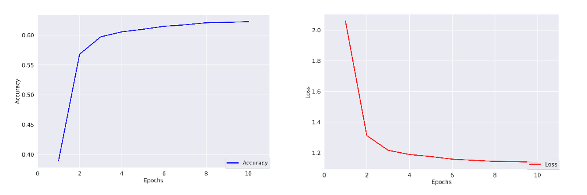

**Optical Character Recognition – Car Plate Recognition**

In this project, I developed an optical character recognition (OCR) model using PyTorch, The workflow can be summarized as follows:

## Data Preparation
In my implementation, I divided the project into two stages: model training and transfer learning. Let's explore each stage in more detail:

**Model Training Stage:**

In the first stage, I utilized the balanced EMNIST dataset, which is a well-known collection of handwritten character digits and letters. This dataset serves as a standard benchmark for deep learning applications [1]. As the name suggests, the dataset is carefully balanced, ensuring an equal number of samples for each class. This balanced nature allows the model to effectively learn the distinct characteristics of both digits and letters.

*Figure 1. An image of the custom dataset*

**Transfer Learning Stage:**

Moving on to the second stage, I introduced a custom dataset specifically designed to resemble the style of typical car plate digits and letters, as depicted in Figure 1. This dataset consisted of 114 images, and I manually labeled each image to provide the model with the necessary information to recognize the specific character patterns found on car plates. To address the potential issue of class imbalance, I employed the WeightedRandomSampler from PyTorch. This technique helps mitigate the performance degradation that can occur due to imbalanced class distributions. By assigning appropriate weights to each class during the sampling process, we ensure that the model receives sufficient exposure to all classes, regardless of their initial frequency.

In both stages of data preparation, I incorporated data augmentation techniques to further enhance the model's performance. These techniques, including flipping, cropping, rotation, grayscale conversion, and normalization, aim to increase the diversity of the training data. PyTorch offers a convenient pipeline for implementing various data augmentations, enabling us to create a more robust and generalized model.

## Stage 1: Model Training
In this stage, I incorporated transfer learning using the pre-trained ResNet50 model. ResNet50 is a well-known architecture that utilizes residual blocks to handle deep networks effectively [2]. By leveraging a pre-trained model, which has learned diverse image features from tasks like ImageNet classification, we can benefit from its representations and use them as a starting point for our specific task [3]. I trained the ResNet50 model on the balanced EMNIST dataset to further enhance its ability to recognize digits and letters. The model settings are as follows:

|**Dataset**|Balanced EMNIST|
| :-: | :-: |
|**Optimizer**|Adam|
|**Loss**|Cross Entropy|
|**Weight decay**|0\.001|
|**Learning rate**|0\.01|
|**Batch size**|64|
|**Epoch**|10|

*Table 1. Stage 1 model parameters settings*

To prevent overfitting, I implemented regularization techniques and limited the number of training epochs. This helps the model avoid learning unnecessary details from the balanced EMNIST dataset, which may not capture the specific characteristics of car plate characters. By applying regularization and reducing the training epochs, the model can focus on learning essential features and improve its generalization ability.

  
*Figure 2. Accuracy (left) and loss (right) curves in stage 1*

## Stage 2: Transfer Learning
In this stage, we leverage transfer learning to enhance the pre-trained ResNet50 model by utilizing the custom dataset. Transfer learning involves taking advantage of the knowledge acquired from training on a different dataset and applying it to a new task.

During this transfer learning process, we retain the base architecture of ResNet50 and initialize the model with the weights learned in the previous stage. By doing so, we enable the model to build upon the relevant features learned from the balanced EMNIST dataset while adapting them to the specific characteristics of car plate characters present in the custom dataset. By using the custom dataset, we aim to fine-tune the pre-trained model to better understand and recognize the specific characteristics of car plate digits and letters. The model settings are as follows:

|**Dataset**|Custom Dataset|
| :-: | :-: |
|**Optimizer**|Adam|
|**Loss**|Cross Entropy|
|**Weight decay**|/|
|**Learning rate**|0\.001|
|**Batch size**|16|
|**Epoch**|200|

*Table 2. Stage 2 model parameters settings*

This stage holds great significance as it involves training the model multiple times using the custom dataset, which captures the most meaningful and useful characteristics for the OCR task. To ensure thorough learning, the model is trained for 200 epochs. Interestingly, regularization techniques were found to have a negative impact on performance, so they were omitted from this stage.

Upon completion of training, the model weights are saved, allowing for easy reusability and deployment in future tasks or inference scenarios. Saving the model weights ensures that the trained model can be utilized without the need for retraining, saving time and computational resources.

*Figure 3. Accuracy (left) and loss (right) curves in stage 2*

In both stages of the training process, the curves depicting accuracy and loss exhibit a flawless trajectory, characterized by a consistent ascent in accuracy and a corresponding descent in loss. Consequently, we can confidently deduce that the model has indeed assimilated the essential knowledge contained within the dataset.

## OCR perform
The trained OCR model is reloaded to perform OCR on car plate images. Preprocessing steps, including adding a border, grayscale conversion, resizing, and normalization, are applied to the input image. The processed image is then fed into the OCR model, which outputs recognized characters and corresponding confidence levels. If the confidence level is below 0.5, it is considered a recognition failure. The final output is the recognized car plate result, including any recognition failures.

## References:
[1] Cohen, Gregory, et al. "EMNIST: Extending MNIST to handwritten letters." *2017 international joint conference on neural networks (IJCNN)*. IEEE, 2017.

[2] He, Kaiming, et al. "Deep residual learning for image recognition." *Proceedings of the IEEE conference on computer vision and pattern recognition*. 2016.

[3] Mukti, Ishrat Zahan, and Dipayan Biswas. "Transfer learning based plant diseases detection using ResNet50." *2019 4th International conference on electrical information and communication technology (EICT)*. IEEE, 2019.
